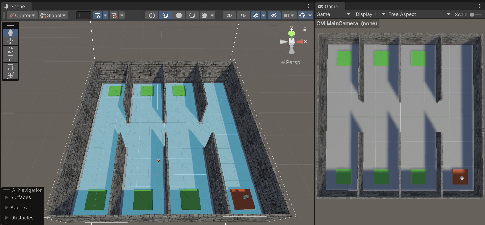

# unity3d: Basic Player Controller - Bird Eye View

Control a player in a 3D environment using Unity3D.
I used the `StarterAssets` package as a base for the project.

    Tested on
    : macOS 14.4.1
    : Unity 2023.2.7f1
      : JetBrains Rider Editor 3.0.27

## Description

- Fixed camera view (Bird Eye View)
- Logging console messages for debugging ([Debugger.cs](https://gist.github.com/AppleBoiy/958a5b47891e2c789ab0e5e4e5c109c2))

## Key bindings

<table>

<thead>
<tr>
<td>Basic movement</td>
<td>Other</td>
</tr>
</thead>

<tbody>

<!-- Basic movement -->
<tr>
<td>

<table>
<tbody>

<tr><td><kbd>W</kbd></td><td>Move forward</td></tr>
<tr><td><kbd>S</kbd></td><td>Move backward</td></tr>
<tr><td><kbd>A</kbd></td><td>Move left</td></tr>
<tr><td><kbd>D</kbd></td><td>Move right</td></tr>
<tr><td><kbd>Space</kbd></td><td>Jump</td></tr>

</tbody>
</table>

</td>
<td>
<!-- Other -->

<table>
<tbody>

<tr><td><kbd>L-Shift</kbd></td><td>Run</td></tr>

<tr><td><kbd>Esc</kbd></td><td>Open menu</td></tr>
</tbody>
</table>

</tr>
</tbody>
</table>

## References

- [FIRST PERSON MOVEMENT in 10 MINUTES - Unity Tutorial](https://www.youtube.com/watch?v=f473C43s8nE)
- [StarterAssets - FirstPerson](https://assetstore.unity.com/packages/essentials/starterassets-firstperson-updates-in-new-charactercontroller-pac-196525)